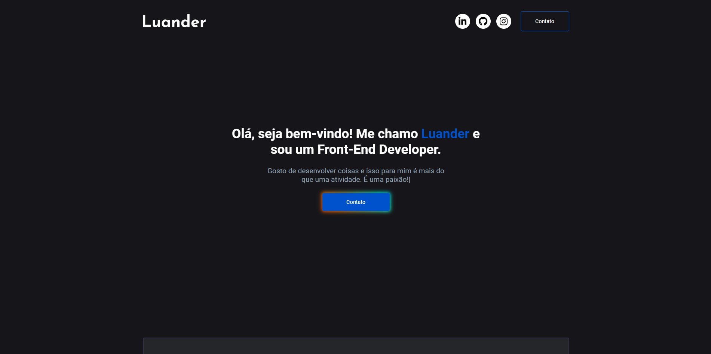

<h1 align="center">
    👋 Meu portfólio
</h1>

<h4 align="center"><a href="https://portfolio-eta-swart-98.vercel.app/">Clique aqui para visualizar o projeto</a></h4>

## Visão Geral 

Esse é meu portfólio pessoal, onde apresento alguns dos meus projetos, habilidades e forneço um meio de entrar em contato comigo. O portfólio é composto por duas páginas principais: a página inicial e a página de contato.

---

## Páginas

#### Página Inicial

A página inicial é composta por quatro seções principais:

- **Apresentação:** Uma breve apresentação sobre mim;
- **Sobre:** Uma seção que detalha um pouco sobre mim;
- **Projetos:** Exibe alguns dos meus projetos;
- **Conhecimentos:** Detalha as tecnologias que possuo conhecimento;

#### Página de Contato

- A página de contato é composta por um formulário permitindo que o usuário consiga enviar um e-mail diretamente para mim.

---

## Tecnologias Utilizadas

- **React**.
- **React Hook Form**.
- **React Router Dom**.
- **React Type Animation**.
- **ScrollReveal**.
- **Styled-components:** Usei para fazer a estilização global.
- **SwalAlert2**.
- **EmailJS**.

---

Esse README é uma visão geral do meu portfólio e das tecnologias utilizadas. Sinta-se à vontade para explorar e entrar em contato comigo. Vale ressaltar que o design do meu portfólio foi inspirado no portfólio do @iuricode